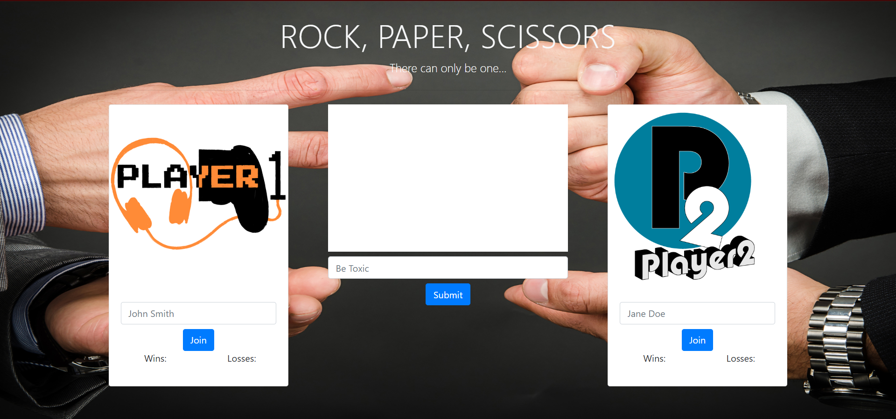
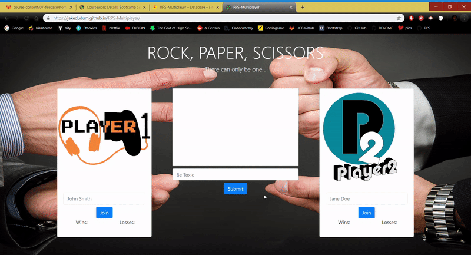

# RPS-Multiplayer

Rock, Paper, Scissors Online Multiplayer! Two players are able to play at any time by joining either player 1 or player 2 with a name input. The center of the site features a chat box for the two players to talk to each other as well as for the site to display who has won. Wins and losses for each side are shown below each player's name and are reset to 0 upon a player leaving the game. To leave the game players can simply close the window the game is being played in which will enable other players to join in their place. Player 2 always goes after Player 1 and only the players can see their button options(other users can simply observe and wait for an open player space). The online multiplayer component of the site is made possible using [Firebase](https://firebase.google.com/)'s realtime online database.

# Link to Deployed Site
- [RPS-Multiplayer](https://jakedudum.github.io/RPS-Multiplayer/)

# Demo

# Built With
- [HTML](https://developer.mozilla.org/en-US/docs/Learn/HTML)
- [CSS](https://developer.mozilla.org/en-US/docs/Web/CSS)
- [Bootstrap](https://getbootstrap.com/)
- [Javascript](https://developer.mozilla.org/en-US/docs/Web/JavaScript)
- [Jquery](https://jquery.com/)
- [Firebase](https://firebase.google.com/)

# Versioning
- [Github](https://github.com/)

# Authors
### Jake Dudum

# Acknowledgments
- Darryl Tolentino for help with bootstrap styling and helping me to create the demo